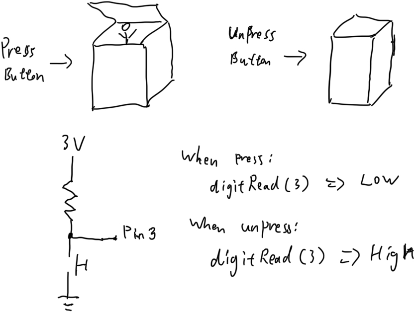
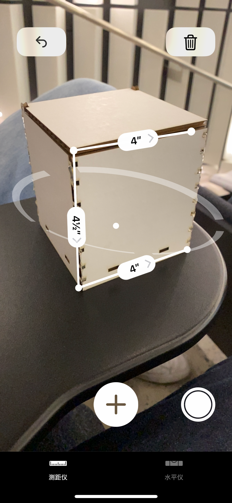

# Jack in the Box

## Design

Please put your sketches or designs for the Jack in the Box.



## Laser Cutting

**a. Include a photo of your box here.**

Measuring it with **Measure** app on iPhone:


**b. Include `.stl` files.**

No stl files were used in laser cutting.

## 3D Printing

**a. Include a photo of your printed part here.**

**b. Include `.stl` or `.svg` files if you made modifications.**

[STL file](Jack.stl)

## Electronics

**a. Upload code & a photo of your electronic circuit here.**

```
#include <Servo.h>

Servo myservo;  // create servo object to control a servo
// twelve servo objects can be created on most boards

void setup() {
  myservo.attach(9);  // attaches the servo on pin 9 to the servo object
}

int sp = 0;
int ep = 90;

void loop() {
  if(digitalRead(3) == HIGH) {
    jackin();
  } else {
    jackout();
  }
}

void jackout() {
  myservo.write(ep);
}

void jackin() {
  myservo.write(sp);
}
```


## Putting it All Together

Include here:

1.Your Arduino code.

[Same as last section](JackInAndOutTheBox/JackInAndOutTheBox.ino)

2.At least one photo of your Jack in the Box taken in the MakerLab's Portable Photo Studio (or somewhere else, but of similar quality).


3.A video of your Jack in the Box in action.

**[Link](https://youtu.be/FHC95aJaYLI)**